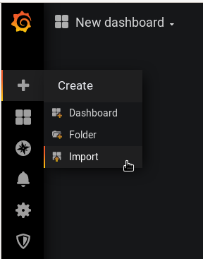
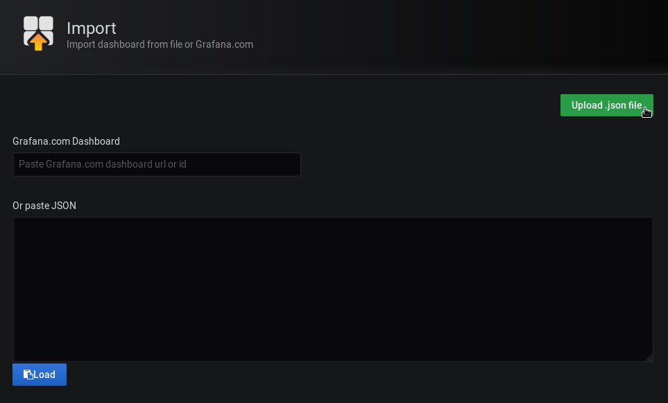
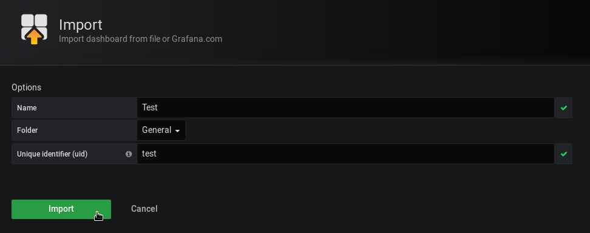

KCIDB-Grafana
=============
KCIDB-Grafana is a collection of documentation/scripts/data files needed to
setup and maintain an instance of [Grafana](https://grafana.com/) displaying
Linux Kernel CI reports stored in a
[KCIDB](https://github.com/kernelci/kcidb/) database.

Architecture
------------

The current setup on [staging.kernelci.org](https://staging.kernelci.org:3000)
is implemented with a tweaked, but stock Grafana container, exposing port 3000
on localhost, and a Nginx configuration forwarding HTTPS connections on
outside port 3000 to it.

Grafana is configured with the following.

* BigQuery data source using a Google JWT file for authenticating to the KCIDB
  dataset with US as the processing location.
* A single organization called "Kernel CI".
* A number of dashboards displaying various objects in the database, with one
  of them ("Home") set as the home dashboard.
* Anonymous access enabled, and the "Kernel CI" organization appointed for it.

Setup
-----
Pull Grafana container image from Docker registry:

    docker pull grafana/grafana:6.6.0

Create a persistent volume to store Grafana configuration and data:

    docker volume create grafana-storage

To create and start a Grafana container run:

    docker run -d -p 127.0.0.1:3000:3000 \
               --name grafana \
               --restart=unless-stopped \
               -v grafana-storage:/var/lib/grafana \
               -e GF_INSTALL_PLUGINS=doitintl-bigquery-datasource \
               -e GF_SERVER_DOMAIN=staging.kernelci.org \
               -e GF_SERVER_HTTP_PORT=3000 \
               -e GF_AUTH_ANONYMOUS_ORG_NAME="Kernel CI" \
               -e GF_AUTH_ANONYMOUS_ENABLED=true \
               grafana/grafana:6.6.0

For development setup, remember to adjust or drop the GF_SERVER_DOMAIN
and GF_SERVER_HTTP_PORT settings.

Login as an administrator (default credentials are `admin`/`admin`).

Import each of the dashboards from this repository, following the steps below.

1. Click "+"->"Import".

   

2. Click "Upload .json file", select dashboard file.

   

3. Do not change properties, unless you know what you're doing.

   

Development
-----------
To update dashboard files in this repository, export and overwrite each of
them, following the steps below.

1. Click "Share dashboard".

   

2. Click "Export", and then "Save to file".

   
